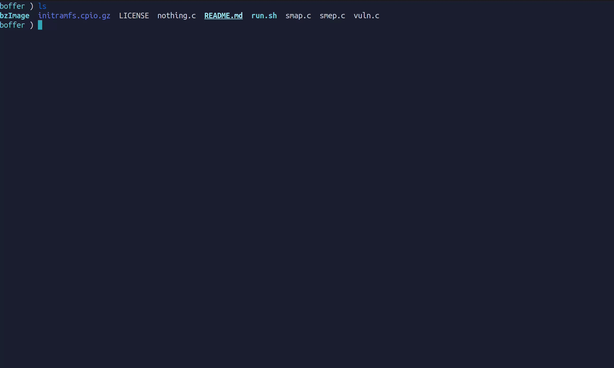

# Boffer

A stand for practicing CFHjack in the Linux kernel

<p align="center"></p>

## Purpose

The purpose of this project is to provide a safe and controlled environment for learning about
Linux kernel security and exploiting vulnerabilities.

## Background

Control Flow Hjack is a well-known problem in Linux kernel security so there are various mitigations.
This project aims to provide a hands-on environment for learning about these topics and practicing exploitation techniques.

## Usage

### About PoCs

- `nothing.c` works only without mitigations
- `smep.c` beats down the SMEP
- `smap.c` wins both: SMEP and SMAP

### Preparing

Get a script to retrieve __vmlinux__ form __bzImage__:

```bash
wget https://git.kernel.org/pub/scm/linux/kernel/git/torvalds/linux.git/plain/scripts/extract-vmlinux -O extract-vmlinux.sh
```

Extract __vmlinux__:

```bash
bash extract-vmlinux.sh bzImage > vmlinux
```

### Exploring

In the first terminal, run:

```bash
bash run.sh
y
y
```

Then, in the second:

```
gdb vmlinux
target remote 127.0.0.1:1234
break *0xffffffffc0000057
c
```

Return to the VM (1st terminal):

```
./smap

```

And here we are! Watch the kernel buffer overflow!

```
──────────────────────[ DISASM / x86-64 / set emulate on ]───────────────────────

 ► 0xffffffffc0000057    ret                                <0xffffffff81784532>
    ↓
   0xffffffff81784532    mov    esp, 0x83000000		    ESP => 0x83000000
   0xffffffff81784537    ret
```

For example, here you can see the _stakpivoting_ technique. Simply press `c` in __gdb__ to achieve root.

```
/exp $ id
uid=1000(chal) gid=1000(chal) groups=1000(chal)
/exp $ grep -o -E "smep|smap" /proc/cpuinfo 
smep
smap
/exp $ id
uid=1000(chal) gid=1000(chal) groups=1000(chal)
/exp $ ./smap
[+] device opened
[+] the flow is defeated!
/exp # id
uid=0(root) gid=0(root)
/exp #
```
